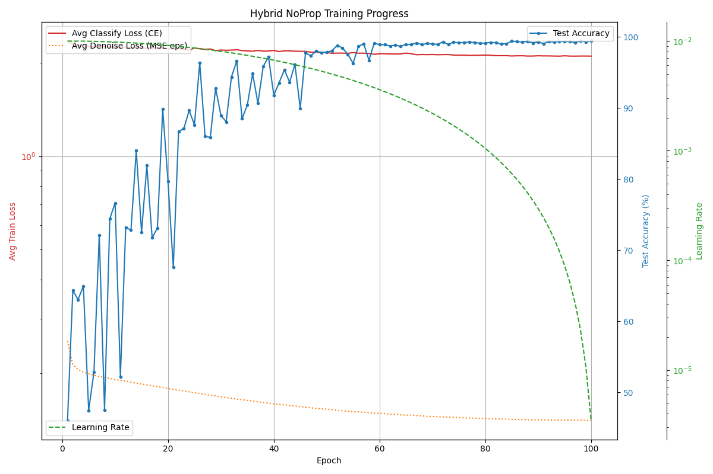

# NoProp-PyTorch: An Experimental Implementation of Training Without Backpropagation

## Description

This repository contains an experimental PyTorch implementation exploring the **NoProp** algorithm, presented in the paper "NOPROP: TRAINING NEURAL NETWORKS WITHOUT BACK-PROPAGATION OR FORWARD-PROPAGATION".

The goal of NoProp is to train neural networks without relying on traditional end-to-end backpropagation. Instead, it trains network layers (blocks) independently using a local denoising objective inspired by diffusion models.

**Disclaimer:** This is an educational implementation attempt based on the paper. Achieving stable training and high accuracy required **significant deviations from the original method** described in the paper, particularly regarding the denoising target, the block loss function, and the classification mechanism. This implementation demonstrates the feasibility of a modified, hybrid approach.

## Source Paper

* **Title:** NOPROP: TRAINING NEURAL NETWORKS WITHOUT BACK-PROPAGATION OR FORWARD-PROPAGATION
* **Authors:** Qinyu Li, Yee Whye Teh, Razvan Pascanu
* **arXiv:** [https://arxiv.org/abs/2503.24322v1](https://arxiv.org/abs/2503.24322v1) 

## Core Concept of NoProp (and Implementation Differences)

* **Original NoProp Idea:**
    * Network blocks are trained independently.
    * Each block `t` learns to predict a "clean" target label embedding `u_y` from the input `x` and a noised version `z_{t-1}`.
    * Inference uses Equation 3 from the paper.

* **Problems & Modifications in this Implementation:**
    * Training blocks to predict the clean `u_y` proved unstable and ineffective.
    * **Key Change 1:** The objective of the blocks was changed to predict the **added noise $\epsilon$**, similar to standard diffusion models (DDPM, VDM, CARD).
    * **Key Change 2 (Hybrid Block Loss):** The loss for updating block `t` became a **combination** of local noise prediction ($MSE(\hat{\epsilon}, \epsilon)$) and a global target reconstruction loss ($MSE(\hat{u}_t, u_y)$), where $\hat{u}_t$ is the clean embedding reconstructed using the predicted $\hat{\epsilon}$.
    * **Key Change 3:** The classifier was trained on the **predicted clean embedding $\hat{u}_T$** (reconstructed from $z_{T-1}$ and predicted $\hat{\epsilon}_T$), instead of the noisy sample $z_T$.
    * **Key Change 4:** Inference was modified to a **DDPM-like reverse process** using the predicted noise $\epsilon$.

## Implementation Details (Final Working Configuration - Hybrid)


* **Framework:** PyTorch
* **Method:** Modified NoProp-DT with **Hybrid Block Loss** (predicting noise $\epsilon$, classifying from $\hat{u}_T$).
* **Dataset:** MNIST
* **Architecture:** CNN+MLP blocks (`DenoisingBlockPaper`) predicting noise $\epsilon$.
* **Block Loss:** Combined $L_{block\_t} = \eta_1 MSE(\hat{\epsilon}, \epsilon) + \eta_2 MSE(\hat{u}_t, u_y)$, where $\hat{u}_t$ is reconstructed from $\hat{\epsilon}$. Classifier loss $L_{classify}=CE(\text{classifier}(\hat{u}_T), y)$. Combined update used for optimizers.
* **Embeddings:** Learned (`dim=20`), orthogonal initialization, norm clipping (`max_norm_embed=50.0`), very low weight decay (`embed_wd=1e-7`).
* **Noise Schedule:** Cosine schedule, T=10 steps.
* **Loss Weights:** `ETA_LOSS_WEIGHT`($\eta_1$, for MSE on $\epsilon$) = 2.0, `LAMBDA_GLOBAL`($\eta_2$, for MSE on $\hat{u}_t$) = 1.0. *(Based on final successful run parameters)*
* **Inference:** DDPM-like reverse steps using predicted $\epsilon$.
* **Optimizer:** AdamW with initial `LR=0.01`, `Weight Decay=1e-3` for blocks/classifier.
* **Scheduler:** `CosineAnnealingLR` (`T_max=100`, `eta_min=1e-6`).
* **Stabilization:** Gradient clipping (`max_norm=1.0`).
* **Epochs:** Trained up to 100 epochs with early stopping (`patience=15`).

## Current Status & Experimental Results *(Updated Apr 14, 2025)*

After extensive debugging, significant modifications (predicting noise $\epsilon$, classifying from $\hat{u}_T$, implementing a hybrid block loss), and hyperparameter tuning, a successful training configuration was identified.

A full training run (up to 100 epochs) was performed using the best found parameters (`LR=0.01` initial, `ETA=2.0`, `LAMBDA=1.0`, `EMBED_WD=1e-7`), with a `CosineAnnealingLR` scheduler and early stopping.

* **Training Observations:** The training process was stable. Both denoising and classification losses decreased appropriately without collapsing. The embedding norm remained controlled.
* **Final Result:** The model achieved an excellent **best test accuracy of 99.40%** on MNIST (reached around epoch 85-100, before early stopping triggered at epoch 100 based on patience).

The training progress during the final run is visualized below:



## Conclusions from Experiments

* Reproducing the results using the method *as described* in the original NoProp paper (predicting $u_y$) was unsuccessful in this implementation due to instability and collapsing losses.
* Significant **modifications** were essential: changing the prediction target to noise $\epsilon$, altering the classifier input to the reconstructed $\hat{u}_T$, and crucially, implementing a **hybrid block loss** combining local noise prediction and global target reconstruction ($L_{block\_t} = \eta_1 MSE(\hat{\epsilon}, \epsilon) + \eta_2 MSE(\hat{u}_t, u_y)$).
* This **modified hybrid approach**, combined with careful hyperparameter tuning, LR scheduling, and stabilization techniques, successfully trained a model achieving **high accuracy (99.40%)** on MNIST, matching the performance levels mentioned in the source paper but using a different underlying mechanism.
* This result demonstrates the strong potential of backpropagation-free, diffusion-inspired training, although achieving it required significant adaptation and hybridization of the originally proposed NoProp method, aligning it more closely with established diffusion model practices while incorporating elements of global target guidance locally.

## Setup

*(Setup instructions remain the same)*

**Option 1: Using `venv` (Recommended)**
1.  Ensure you have Python 3 installed.
2.  Clone the repository: `git clone <your-repository-url>`
3.  Navigate to the project directory: `cd <your-repository-name>`
4.  Ensure `requirements.txt` exists with the necessary packages.
5.  Run the setup script (creates/updates `noprop_env`):
    ```bash
    chmod +x setup_env.sh
    ./setup_env.sh
    ```
6.  Activate the environment: `source noprop_env/bin/activate`
7.  Run the script (e.g., for a full run): `python noprop_example.py` (make sure `RUN_HPO = False` inside the script and the correct final hyperparameters are set in the `else` block).

**Option 2: Manual Installation**
1.  Ensure you have Python 3 installed.
2.  Clone the repository.
3.  Navigate to the project directory.
4.  Create/activate a virtual environment.
5.  Install dependencies: `pip install -r requirements.txt`
6.  Run the script: `python noprop_example.py`